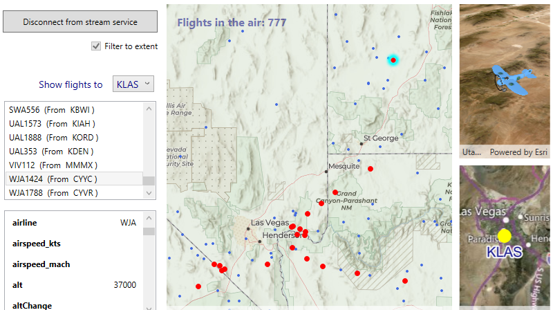

# Flight tracker

A .NET Windows application that illustrates using the ArcGIS Maps SDK for .NET to track air traffic.

The details of the app are described in the blog article [_Create real-time apps with ArcGIS Maps SDKs for Native Apps_](https://www.esri.com/arcgis-blog/products/sdk-net/developers/create-real-time-apps-with-arcgis-maps-sdks-for-native-apps/).

### To get started:
1. Clone this repository to your local machine.
1. Open the Visual Studio project (_Flights.csproj_).
    - The required NuGet packages will be restored, including ArcGIS Maps SDK for .NET.
1. Add an API key on [line 22 of _App.xaml.cs_](https://github.com/ThadT/flight-dynamic-entities/blob/main/App.xaml.cs#L22).
    - Visit [developers.arcgis.com](https://developers.arcgis.com/sign-up/) to sign up for a free ArcGIS Developer account and to receive an API key.
1. Update [line 40 of _MainWindow.xaml.cs_](https://github.com/ThadT/flight-dynamic-entities/blob/main/MainWindow.xaml.cs#L40) with a URL to a stream service that provides data from [FlightAware](https://flightaware.com/).
    - You can use another stream service, but will likely have to update field names and other details for the app to work as expected.
    - You may be able to find services to use by searching arcgis.com for [FlightAware](https://www.arcgis.com/home/search.html?q=flightaware) or [GeoEvent stream services](https://www.arcgis.com/home/search.html?q=geoevent+stream+service) to use.
